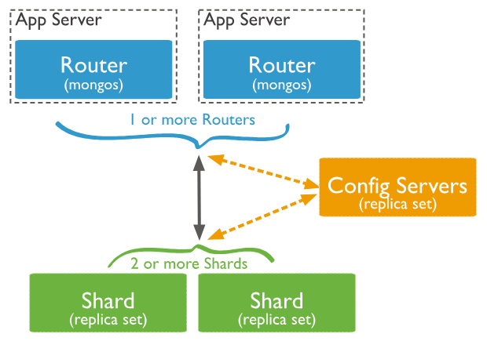

## NoSQL
 
#### What is it?

NoSQL, which stands for "Not Only SQL, is a class of database management systems that is focuses on providing a mechanism for storage and retrival of large volumes of non- relational, unstructured or semi-structured databases.


#### Compare SQL to NoSQL
| DATABASE TYPE  | SQL(relational databases)                                                      | NoSQL(non-relational databases)                                                                    |
|----------------|--------------------------------------------------------------------------------|----------------------------------------------------------------------------------------------------|
| DATA STRUCTURE | Structured data: Organized in a strict, predefined manner (e.g., tables)       | Semi-structured and Unstructured Data: flexible data formats, not restricted to a strict structure |
| SCHEMAS        | Fixed schema: Predefined table structures with specific columns and data types | Dynamic schema: Flexible, can change structure as needed without a predefined schema               |
| LANGUAGE       | Structured Query Language(SQL)                                                 | Database dependant but uses a wide range                                                           |
| SCALABILITY    | Vertically Scalable                                                            | Horizontally Scalable                                                                              |
| STRUCTURE      | Table-based:Data is organized in rows and columns                              | Range of forms i.e. key-value stores, document databases, wide-column stores, and graph databases  |


#### What language(s) can be used?
NoSQL is very flexible supports a wide range of languages for programming and querying. For example JSON, JavaScript,Python,Java, C#, Ruby, Scala etc.

#### Example NoSQL Schema design


- The schema design is not as fixed, it is dynamic, flexible and customisable.

- Embedding NoSQL involves incorporating NoSQL databases directly into applications, enabling data storage and management within the application itself, without requiring a separate database server.

- Arrays and nested structures enable storing related data together within a single document.


#### TYPES OF NoSQL DATABASES


1. Document-Based Schema 
2. Key-Value Store Schema
3. Graph-Based Schema
4. Wide Column Schema

# Types of NoSQL Databases

| **Type**              | **Detailed Description**                                                                                                 |
|-----------------------|---------------------------------------------------------------------------------------------------------------------------|
| **Document-Based**    | Each document can have a different structure, allowing for flexible and dynamic data storage. Suitable for hierarchical data.|
| **Key-Value Store**   | Simple and fast retrieval of values based on keys. Ideal for use cases where quick lookups are essential.                  |
| **Wide Column Store** | Data is stored in a tabular format but optimized for columns. Great for large datasets and high write/read throughput.     |
| **Graph-Based**       | Uses graph structures with nodes, edges, and properties. Excellent for data with complex relationships and connections.    |


#### NoSQL is scalable. Explain the concept and some benefits of it. Any negatives?
Scalability in NoSQL databases refers to handling increased loads by adding more servers (horizontal scaling), unlike SQL databases that often add more power to a single server (vertical scaling).

| **Benefits of NoSQL Scalability**      | **Description**                                                                      |
|----------------------------------------|--------------------------------------------------------------------------------------|
| **High Availability**                  | System remains operational even if some servers fail.                                |
| **Elasticity**                         | Easily add or remove servers to handle traffic changes.                              |
| **Cost-Effective**                     | Use affordable, standard servers instead of expensive high-end ones.                 |
| **Performance**                        | Handle many read/write operations simultaneously.                                    |
| **Geographical Distribution**          | Place servers in different locations for better speed to users.                      |

| **Negatives of NoSQL Scalability**     | **Description**                                                                      |
|----------------------------------------|--------------------------------------------------------------------------------------|
| **Complex Management**                 | Harder to manage multiple servers and ensure data consistency.                       |
| **Consistency Trade-offs**             | Often prioritize availability and speed over strict data accuracy.                   |
| **Data Redundancy**                    | Duplicate data across servers, increasing storage needs.                             |
| **Limited Query Capabilities**         | Less powerful querying options compared to SQL databases.                            |
| **Maturity and Support**               | Some NoSQL databases have fewer tools and support options.                           |

## MongoDB

#### What is MongoDB?
MongoDB is an open source NoSQL database management program that stores data records as documents in a flexible BSON (Binary JSON) format, these are gathered together in collections. 

It is designed to handle large volumes of unstructured or semi-structured data, offering high performance, scalability, and ease of use, and uses collections and documents, providing more flexibility in data storage and retrieval.

#### What are collections and documents in Mongo? 
A collection is a grouping of MongoDb documents (a basic unit of data) and is the equivalent of a table in a relational database system, a collection exist within a single database. A NoSQL Database contains a collection, and a collection contains documents and the documents contain data, they are related to each other. 

#### MongoDB Architecture, how does it work? 

***Components***

Database: A container for collections, similar to a database in SQL.
Collection: A group of MongoDB documents, equivalent to an SQL table.
Document: The basic unit of data in MongoDB, stored in JSON-like BSON format.

***Key Features***

Flexible Schema: Collections do not enforce a schema, allowing for documents with varying structures.
Replication: Ensures data availability and redundancy via replica sets.
Sharding: Distributes data across multiple machines to support horizontal scalability.

#### What are replica sets?
A replica set in MongoDB is a group of mongoDB processes that maintain the same data set. Replica sets provide redundancy and high availability, and are the basis for all production deployments. 


#### What is sharding?
Sharding is a method for distributing data across multiple machines/servers to support high volume operations, it is the key feature of horizontal scaling (dividing up a large database ond allocating the shards to smaller servers, this spreads the load, making it more efficient and powerful).


#### Advantages and Disadvantages of MongoDB?

| **Advantages of MongoDB**            |                                                                                                                         |
|--------------------------------------|-------------------------------------------------------------------------------------------------------------------------|
| **Flexible Schema**                  | MongoDB supports a flexible schema, allowing for the storage of diverse data types without a fixed schema.              |
| **Scalability**                      | MongoDB scales horizontally through sharding, distributing data across multiple servers for high performance.           |
| **High Availability and Redundancy** | MongoDB ensures high availability and redundancy through replica sets, ensuring continuous data availability.           |
| **Performance**                      | MongoDB is optimized for high read and write throughput, making it suitable for real-time applications.                 |
| **Document-Oriented Storage**        | MongoDB stores data in BSON format, which is efficient for hierarchical data structures and nested documents.           |

| **Disadvantages of MongoDB**       |                                                                                                                               |
|------------------------------------|-------------------------------------------------------------------------------------------------------------------------------|
| **Complex Management**             | MongoDB can be complex to manage, especially in distributed environments with multiple nodes and replica sets.                |
| **Consistency Trade-offs**         | MongoDB may prioritize availability and partition tolerance over strict consistency, leading to eventual consistency models.  |
| **Storage Overhead**               | MongoDB's BSON format and dynamic schemas may result in higher storage requirements compared to relational databases.         |
| **Limited Query Capabilities**     | MongoDB lacks some advanced querying and transaction features found in traditional SQL databases.                             |
| **Learning Curve**                 | Transitioning to MongoDB may require a learning curve for developers accustomed to relational databases.                      |


#### MongoDB: Good and Not So Good Scenarios

| **Good Scenarios for MongoDB**                                                                                                                                                            | **Not So Good Scenarios for MongoDB**                                                                                                                                                     |
|-------------------------------------------------------------------------------------------------------------------------------------------------------------------------------------------|-------------------------------------------------------------------------------------------------------------------------------------------------------------------------------------------|
| Document-Oriented Applications: MongoDB is well-suited for applications like content management systems, blogs, and e-commerce sites where data can be represented as flexible documents. | Complex Transactions: MongoDB may not be suitable for applications requiring complex transactions, like banking systems or inventory management.                                          |
| High-Volume Data: MongoDB handles large amounts of data efficiently, making it suitable for real-time analytics, logging, and IoT platforms.                                              | Data Warehousing and BI: MongoDB may not be the best choice for complex analytics and reporting typical in data warehousing and Business Intelligence (BI) scenarios.                     |
| Scalability: MongoDB scales easily as data grows, making it ideal for applications expecting rapid growth, such as social networks and gaming platforms.                                  | Strict Consistency Requirements: MongoDB's eventual consistency model may not meet the strict consistency requirements of applications like financial transactions.                       |
| Agile Development: MongoDB's flexible schema and rapid development capabilities are great for agile environments, allowing quick iterations and adapting to changing requirements.        | Legacy System Integration: Migrating from SQL databases to MongoDB may be challenging for applications with existing SQL-based infrastructure and complex data relationships.             |
| Prototyping and MVPs: MongoDB is perfect for quickly building prototypes and Minimum Viable Products (MVPs) due to its ease of setup and rapid development features.                      | Complex Joins and Aggregations: MongoDB may not handle complex multi-document joins and aggregations as efficiently as SQL databases, impacting performance for query-heavy applications. |

### MONGODB BASICS
### ***CREATE DATABASE***
- Use the ***use*** command to create a database.
````
> use mydatabase
switched to db mydatabase
````

### ***INSERT DOCUMENTS***
- Use the ***insertOne*** command to insert a single document into a collection:
````
> db.collection.insertOne({ "name": "Alice", "age": 30 })
````
- Use the ***insertMany*** command to insert multiple documents into a collection:
````
> db.collection.insertMany([
    { "name": "Bob", "age": 35 },
    { "name": "Charlie", "age": 40 }
  ])
````
### ***QUERY DOCUMENTS***
- Use the ***find*** command to query documents in a collection:
````
> db.collection.find()
````
- You can also specify query criteria to filter documents:
````
> db.collection.find({ "age": { $gte: 30 } })
````

### ***UPDATE DOCUMENTS***
- Use the updateOne command to update a single document in a collection:
````
> db.collection.updateOne({ "name": "Alice" }, { $set: { "age": 31 } })
````

- Use the updateMany command to update multiple documents in a collection:
````
> db.collection.updateMany({ "age": { $gte: 30 } }, { $set: { "status": "active" } })
````

### ***DELETE DOCUMENTS***
- Use the deleteOne command to delete a single document from a collection:
````
> db.collection.deleteOne({ "name": "Alice" })
````

- Use the deleteOne command to delete a single document from a collection:
````
> db.collection.deleteMany({ "status": "inactive" })
````

### ***COUNT DOCUMENTS***
- Use the count command to count the number of documents in a collection:
````
> db.collection.count()
````

### ***DROP COLLECTION***
- Use the drop command to drop (delete) an entire collection:
````
> db.collection.drop()
````
### COMMON OPERATORS

1. $eq (Equals)
Matches values that are equal to a specified value.

> db.collection.find({ "age": { $eq: 30 } })

2. $gt (Greater Than)
Matches values that are greater than a specified value.

> db.collection.find({ "age": { $gt: 30 } })

3. $gte (Greater Than or Equal)
Matches values that are greater than or equal to a specified value.

> db.collection.find({ "age": { $gte: 30 } })

4. $in (In)
Matches any of the values specified in an array.

> db.collection.find({ "age": { $in: [30, 35] } })

5. $lt (Less Than)
Matches values that are less than a specified value.

> db.collection.find({ "age": { $lt: 30 } })

6. $lte (Less Than or Equal)
Matches values that are less than or equal to a specified value.

> db.collection.find({ "age": { $lte: 30 } })

7. $ne (Not Equal)
Matches values that are not equal to a specified value.

> db.collection.find({ "age": { $ne: 30 } })

8. $nin (Not In)
Matches none of the values specified in an array.

> db.collection.find({ "age": { $nin: [30, 35] } })

9. $and: Joins query clauses with a logical AND.
Matches documents that satisfy all the specified conditions.
Example:

> db.collection.find({ $and: [ { "age": { $gte: 30 } }, { "name": "Alice" } ] })
This query will match documents where the age is greater than or equal to 30 AND the name is "Alice".

10. $or: Joins query clauses with a logical OR.
Matches documents that satisfy at least one of the specified conditions.
Example:

> db.collection.find({ $or: [ { "age": { $gte: 30 } }, { "name": "Alice" } ] })
This query will match documents where the age is greater than or equal to 30 OR the name is "Alice".

11. $not: Inverts the effect of a query expression.
Matches documents that do not satisfy the specified condition.
Example:

> db.collection.find({ "age": { $not: { $eq: 30 } } })
This query will match documents where the age is NOT equal to 30.

12. $nor: Joins query clauses with a logical NOR.
Matches documents that do not satisfy any of the specified conditions.
Example:

> db.collection.find({ $nor: [ { "age": { $gte: 30 } }, { "name": "Alice" } ] })
This query will match documents where neither the age is greater than or equal to 30 NOR the name is "Alice".

13. $set: Sets the value of a field in a document.
The $set operator updates the value of a field or adds a new field if it does not exist.
Example:

> db.collection.updateOne(
    { "name": "Alice" },
    { $set: { "age": 25, "status": "active" } }
  )

This command will update the document with the name "Alice" by setting the "age" field to 25 and adding a new field "status" with the value "active".

14. $unset: Removes a field from a document.
The $unset operator removes the specified field from a document.
Example:

> db.collection.updateOne(
    { "name": "Alice" },
    { $unset: { "status": "" } }
  )

This command will remove the "status" field from the document with the name "Alice".

## MONGOBD EXERCISES

### Question 5

1. Find Luke Skywalker: <br>
`db.characters.find({name: "Luke Skywalker"})`
2. Find Chewbacca and list name and eye colour:<br>
`db.characters.find({name: "Chewbacca"}, {name: 1, eye_color: 1})`
   * The binary notation means you write 1 for the columns you want to show, and 0 for those you want to hide.
3. Check the species name of Ackbar: <br>
`db.characters.find({name: "Ackbar"}, {"species.name": 1})`
   * The dot accesses sub-fields inside embedded values (putting key-value pairs as values).

### Question 6:

1. Find the names and homeworld names for humans in the collection: <br>
`db.characters.find({"species.name": "Human"}, {name: 1, "homeworld.name": 1})`

### Question 7:

1. Find all entries that have a yellow or orange eye colour:
`db.characters.find({eye_color: { $in: ["yellow", "orange"]}})`
   * Using $in with an array means you are searching for entities with values in that array.

### Question 8:

1. Filter characters for entities that have blue eyes and are females:
```mongosh
db.characters.find({ 
$and: [
  {eye_color: "blue"},
  {gender: "female"}
  ]
  } 
  {name: 1, eye_color: 1, gender: 1})
```
*   Just like $in, you have $and along with an array, which searches for rows that include all of the values in the array.

2. Filter characters that have blue eyes or are females:
```mongosh
db.characters.find({ 
$or: [
  {eye_color: "blue"},
  {gender: "female"}
  ]
  }, 
  {name: 1, eye_color: 1, gender: 1})
```
*   $or ensures at least one of the values in the array are met.
### Question 9:

1. Filter characters that have a height greater than 200: <br>
`db.characters.find( { height: { $gt: 200 } }, {name: 1, height: 1} )`
   * $gt, the aggregation function for >, doesn't require a []
2. Convert "unknown" to null values: <br>
`db.characters.updateMany(
    { height: "unknown" },
    { $set: { "height": null } })`
   * Here I am finding all the entities with height as a string "unknown", and then using $set to put the height value in these entities as null.
3. Convert to integers:
```
db.characters.updateMany(
    {},
    [
    {$set: {height: { $toInt: "$height" }}}
    ]
)
```
Here, I am finding every entity in the collection with {}, and because the function $toInt is being used to collect an entire height column of integers, the [] surround the column to produce an array, which is then updated into the documents.

### Other Functions:
* **$eq**: returns True if the two values are equal: <br>
`qtyEq250: { $eq: [ "$qty", 250 ] }` returns True if the values inside the array are the same. <br>
<br>
* **$gte**: Returns True if the right value is greater than or equal to the left value: <br>
`qtyGte250: { $gte: [ "$qty", 250 ] }` returns
```mongosh
{ "item" : "abc1", "qty" : 300, "qtyGte250" : true }
{ "item" : "abc2", "qty" : 200, "qtyGte250" : false }
{ "item" : "xyz1", "qty" : 250, "qtyGte250" : true }
{ "item" : "VWZ1", "qty" : 300, "qtyGte250" : true }
{ "item" : "VWZ2", "qty" : 180, "qtyGte250" : false }
```

* **$lt** and **$lte** are 'less than' and 'less than or equal to': <br>
`qtyLt250: { $lt: [ "$qty", 250 ] }` & `qtyLte250: { $lte: [ "$qty", 250 ] }`
<br> <br>
* **$ne** returns True for when the two values in the array are not equal: <br>
`qtyNe250: { $ne: [ "$qty", 250 ] }` returns
```
{ "item" : "abc2", "qty" : 200, "qtyNe250" : true }
{ "item" : "xyz1", "qty" : 250, "qtyNe250" : false }
```
* **$nin**: the opposite of $in above: <br>
`db.characters.find({ mass : {$nin: []}})` finds the documents for which mass is not an empty string.


